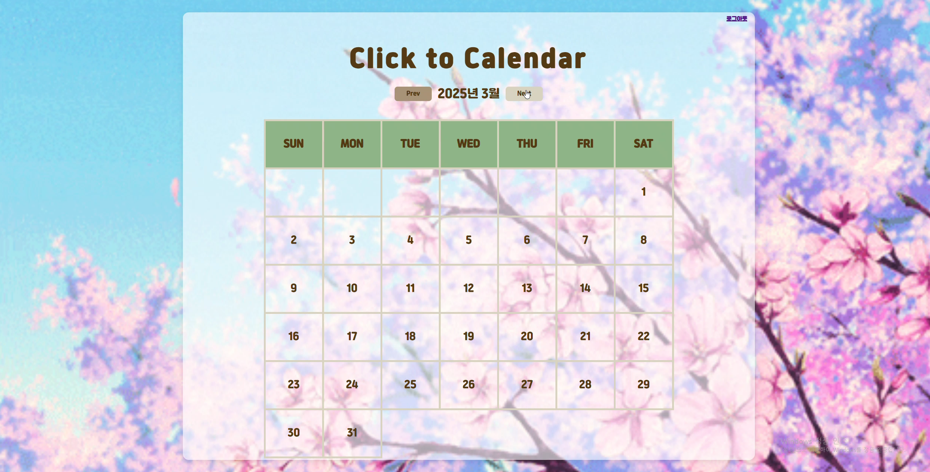
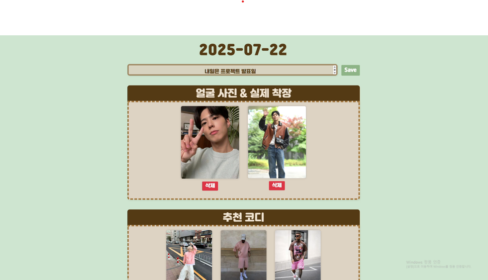

# 👔 StyleCast - AI 기반 착장 예보 시스템

> 날씨·계절·기온 정보를 사용자 사진 기반 감정·성별 분석 및 감정 보완 색상 매칭을 조합해 컨디 이미지 자동 추천 및 날짜별 저장 기능을 포함한 웹 서비스 형태로 완성


---

## 📋 프로젝트 개요

날씨·계절·기온 정보를 사용자 사진 기반 감정·성별 분석 및 감정 보완 색상 매칭을 조합해 코디 이미지 자동 추천 및 날짜별 저장 기능을 포함한 웹 서비스 형태로 완성한 AI 착장 추천 시스템입니다.

### 🎯 주요 목표
- **OpenWeather API**를 활용한 날씨·계절 정보 수집 로직 구현
- **AWS Rekognition** 기반 감정·성별 분석 및 감정 보완 색상 매칭 설계
- 날씨·감정·성별 정보를 조합한 **검색 키워드 생성 로직** 구현

---

## ✨ 주요 기능

### 1. 날씨 기반 분석
- **OpenWeather API**를 활용한 날씨·계절 정보 수집 로직 구현
- **AWS Rekognition** 기반 감정·성별 분석 및 감정 보완 색상 매칭 설계
- 날씨·감정·성별 정보를 조합한 **검색 키워드 생성 로직** 구현

### 2. AI 얼굴 인식
- **AWS Rekognition** 기반 감정·성별 분석
- 감정 보완 색상 매칭 설계

### 3. 코디 추천
- 조건 기반 키워드(날씨, 감정, 성별)으로 **코디 이미지 자동 추천 및 날짜별 저장**
- **사용자 계정·세션·기록 관리** 기능을 포함한 웹 서비스 형태로 완성도 확보

---

## 🏗️ 시스템 아키텍처

### 📊 키워드 생성 Flow Chart
```
┌─────────────┐
│PHOTO UPLOAD │
└──────┬──────┘
       ▼
┌─────────────┐   No    ┌─────────────┐
│DETECT FACE  │───────▶│  BUTTON:    │
│ EMOTION?    │         │ POSITION    │
└──────┬──────┘         │  EMOTION    │
       │Yes             └─────────────┘
       ▼
┌─────────────┐
│GET WEATHER  │
│  & SEASON   │
└──────┬──────┘
       ▼
┌─────────────┐         ┌──────────────────────┐
│   SEARCH    │         │3. 랜덤제스트 크롤링    │
│  PINTEREST  │         │계절, 성별, 감정별 타겟 │
└──────┬──────┘         │키워드 추출 및 코디 검색│
       ▼                └──────────────────────┘
┌───────────────┐       ┌─────────────────────┐
│   DISPLAY     │       │     4. 코디 추천     │
│RECOMMENDATIONS│       │ 페이지 사진 코드 저장 │
└───────────────┘       │ 코디 사진 리턴 및 저장│
                        └─────────────────────┘
```

### 📊 착장 예보 홈페이지 출력 화면



---

## 🔧 개발 환경

|      항목     | 사양 |
|---------------|------|
| **Language**  | Python 3.x |
| **Framework** | Flask (Web), Selenium (Crawling) |
|    **API**    | OpenWeather API, AWS Rekognition API |
|  **Frontend** | HTML, CSS, JavaScript, JSON |
|  **Database** | File-based storage (JSON) |

---

## 📈 성능 지표

### ✅ 검증 결과
- 조건 기반 키워드(날씨, 감정, 성별)으로 **코디 이미지 자동 추천 및 날짜별 저장**
- **사용자 계정·세션·기록 관리** 기능을 포함한 웹 서비스 형태로 완성도 확보

### 🐛 Trouble Shooting

#### 1. 문제: Chrome 브라우저와 Driver **버전 불일치**로 Selenium 크롤링이 정상 실행되지 않음
- **해결**: Chrome 브라우저와 및 Driver를 동일 버전으로 재설치하고, 실행 권한을 부여해 정상 동작 확인

#### 2. 문제: Pinterest 자동 로그인 **반복으로 계정 차단 위험**이 발생
- **해결**: 로그인 세션을 유지하는 방식으로 그룹링 구조를 개선해 빈도 제한 문제를 완화함

---

## 📁 프로젝트 구조

```
StyleCast/
├── app.py                  # Flask 메인 앱
├── weather.py              # OpenWeather API
├── face_detection.py       # AWS Rekognition
├── pinterest_crawler.py    # Selenium 크롤링
├── templates/              # HTML 템플릿
│   ├── index.html
│   ├── result.html
│   └── history.html
├── static/                 # CSS, JS, 이미지
│   ├── css/
│   ├── js/
│   └── images/
├── data/                   # 사용자 데이터
│   └── user_history.json
├── requirements.txt        # Python 패키지
└── README.md
```

---

## 🚀 사용 방법

### 1. 환경 설정
```bash
# Python 가상환경 생성
python -m venv venv
source venv/bin/activate  # Windows: venv\Scripts\activate

# 패키지 설치
pip install -r requirements.txt
```

### 2. API 키 설정
```bash
# .env 파일 생성
OPENWEATHER_API_KEY=your_api_key_here
AWS_ACCESS_KEY_ID=your_access_key_here
AWS_SECRET_ACCESS_KEY=your_secret_key_here
AWS_REGION=ap-northeast-2
```

### 3. 웹 서버 실행
```bash
python app.py
```

### 4. 브라우저에서 접속
```
http://localhost:5000
```

---

## 🎨 주요 기능 설명

### 1. 사진 업로드
- 사용자가 사진을 업로드하면 AWS Rekognition이 얼굴을 감지하고 감정·성별을 분석

### 2. 날씨 정보 수집
- OpenWeather API를 통해 현재 위치의 날씨·기온·계절 정보를 수집

### 3. 키워드 생성
- 날씨, 감정, 성별 정보를 조합해 검색 키워드 생성
- 예: "봄 캐주얼 여성 화사한"

### 4. 코디 추천
- Pinterest에서 생성된 키워드로 코디 이미지 크롤링
- 추천된 코디를 날짜별로 저장

### 5. 기록 관리
- 사용자별 코디 추천 기록을 저장하고 조회 가능

---

## 🌈 감정별 색상 매칭

|      감정     |      추천 색상    |     설명    |
|---------------|-------------------|-------------|
|   **Happy**   | 밝은 노란색, 오렌지 | 활기찬 느낌 |
|    **Sad**    |   따뜻한 파스텔 톤  |  기분 전환  |
|   **Angry**   |  차분한 블루, 그린  |  진정 효과  |
|   **Calm**    |    화이트, 베이지   | 평온함 유지 |
| **Surprised** |     비비드 컬러     | 에너지 강조 |

---

## 📊 날씨별 코디 추천

| 날씨 | 추천 스타일 |
|------|------------|
| **맑음** | 가벼운 셔츠, 면 소재 |
| **흐림** | 레이어드 룩, 카디건 |
| **비** | 방수 재킷, 밝은 색상 |
| **눈** | 두꺼운 코트, 부츠 |
| **더움(30°C 이상)** | 린넨, 반팔 |
| **추움(10°C 이하)** | 패딩, 목도리 |

---

## 📚 참고 자료

- [OpenWeather API Documentation](https://openweathermap.org/api)
- [AWS Rekognition Documentation](https://docs.aws.amazon.com/rekognition/)
- [Selenium Documentation](https://www.selenium.dev/documentation/)
- [Flask Documentation](https://flask.palletsprojects.com/)

---

## 👤 Author

**이서영 (Lee Seoyoung)**
- 📧 Email: lsy1922@naver.com
- 🔗 GitHub: [@seoY0206](https://github.com/seoY0206)

---

## 📝 License

This project is for educational purposes.

---

<div align="center">

**⭐ 도움이 되었다면 Star를 눌러주세요! ⭐**

</div>
